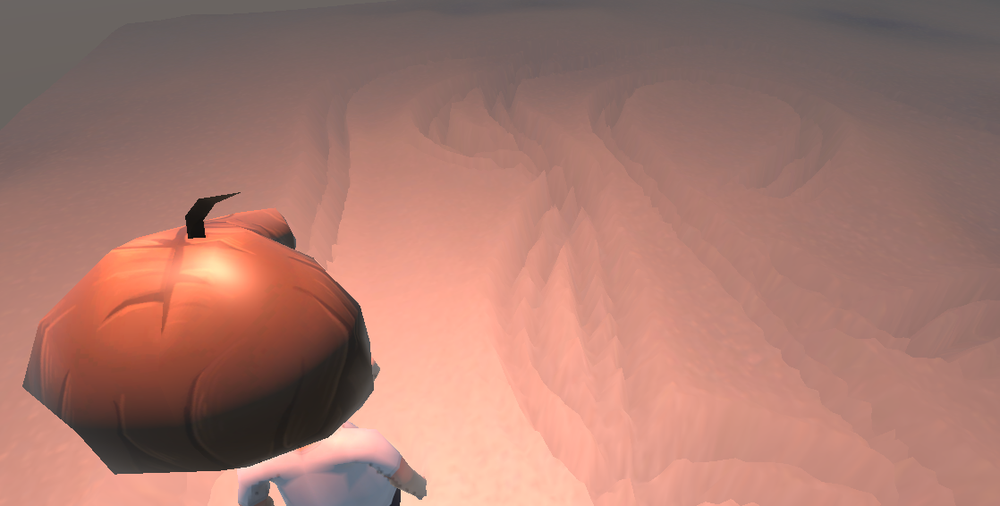
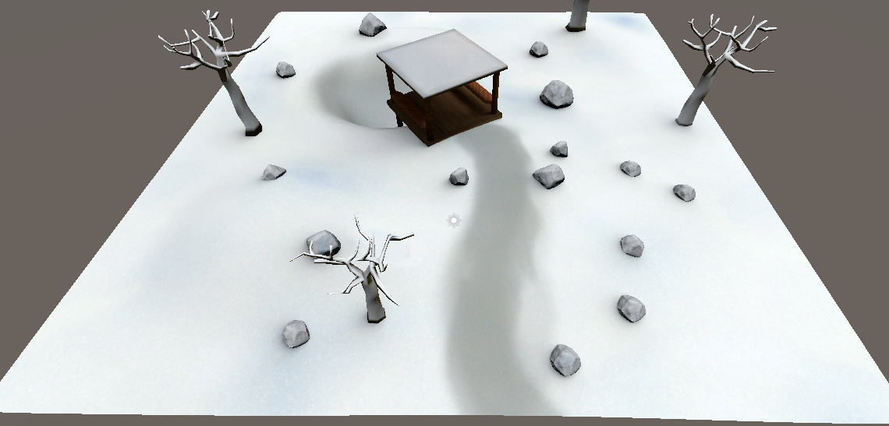
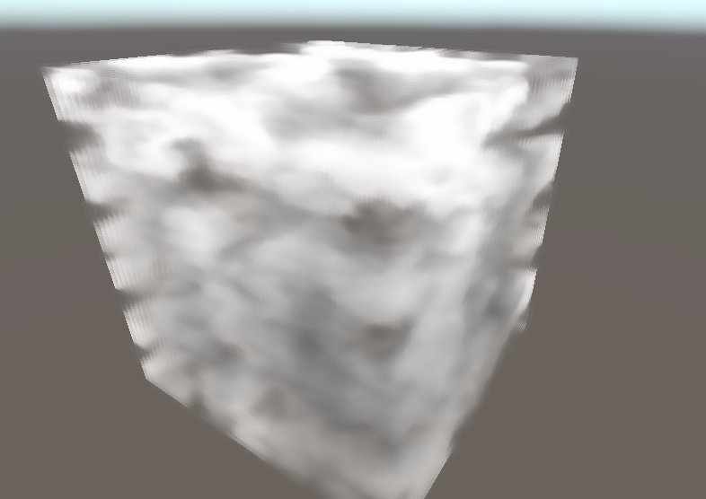

# Unity渲染效果 不断更新

这个项目将集成一些相关的渲染效果，最终成为一个完整的场景

目前已完成：

动态雪地

雪地覆盖

体积云（待优化）

## 动态雪地

采用两张深度图分别记录物体位置与地面位置，计算出运动轨迹，根据轨迹进行凹陷。同时进行边缘检测，高斯模糊，实现雪地边缘的略微突起与内部平滑凹陷。

这个效果位于Assets/交互雪：

- CameraRenderOnce.cs: 手动使相机渲染一次，记录地面的初始深度
- ComputeDepthDiffer.cs: 调用ComputeShader计算深度差，并进行边缘检测、高斯模糊等处理（这个脚本的命名没有很准确）
- DifferDepth.compute: 实现上述效果的Compute Shader
- InteractiveSnowGround.shader: 雪地主材质shader
- SnowGroundManager.cs: 为shader进行参数赋值，如相机参数等

待改进的问题：边缘过渡还是不够平滑，例如人物两腿间距小，导致有锐利的突起，看上去更像碎冰。

## 雪地覆盖

这个效果相对而言比较容易，直接用顶点法线与向上的法向量相乘即可得到雪覆盖的效果，加上遮罩贴图来提升质感

在做这个效果中学到的主要是从blender中烘焙贴图，这里场景中使用的均为提前烘焙的静态贴图，因此不对光照做出反应

这个效果位于Assets/雪地覆盖

## 体积云（待优化）

> 云内部散射没有考虑，可能会导致内部过黑，且颜色不够有层次感，待优化

主要是在Renderer Feature，自定义后处理上踩了很多坑，同时由于为了适应新版URP，甚至于遇到了引擎本身的bug

主要思路是利用后处理实现（知乎上的文章都是采用后处理，但是是否有必要？后面可以尝试以正常半透明物体进行渲染），深度图重建世界坐标，采用光线步进，使用3D噪声图粗略模拟云的密度、光线传播衰减、折射率对光照的影响，简略模拟出体积云。

这个效果位于Assets/体积云：

- CloudPostProcess.shader，体积云后处理的主要shader文件，包含两个pass，第一个pass通过光线步进获取光照信息，第二个pass进行模糊处理，消除噪点。
- CloudDepth.shader，由于是采用后处理实现，为云写入深度
- VolumetricCloudRendererFeature.cs，挂载到renderer feature中，实现自定义后处理
- Cloud.cs，将云物体的参数传给material

