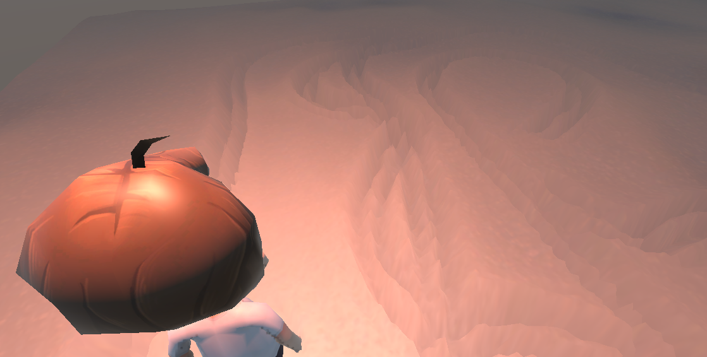
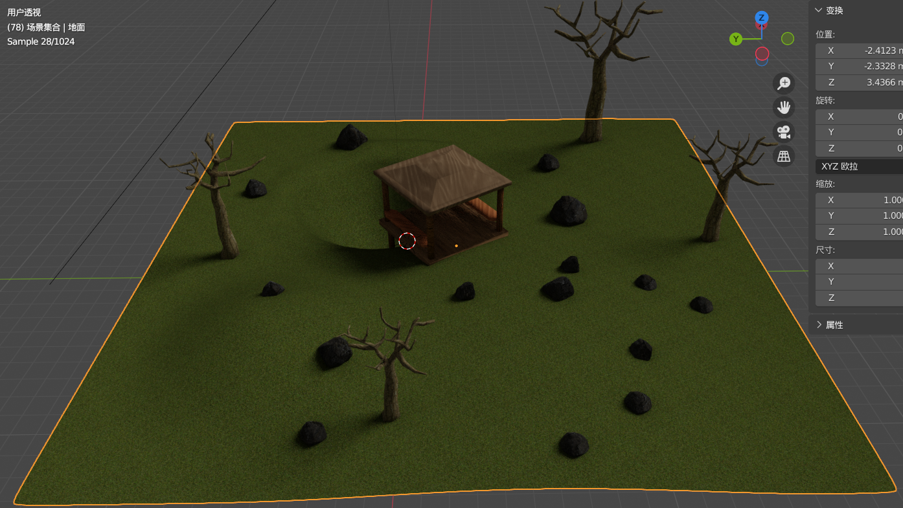
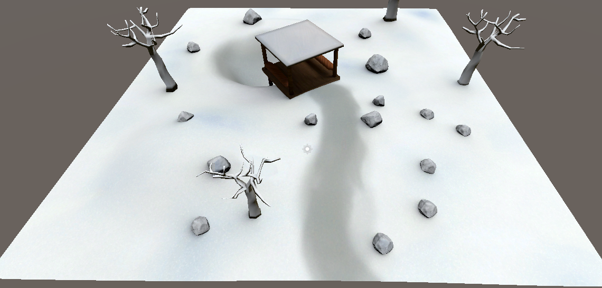
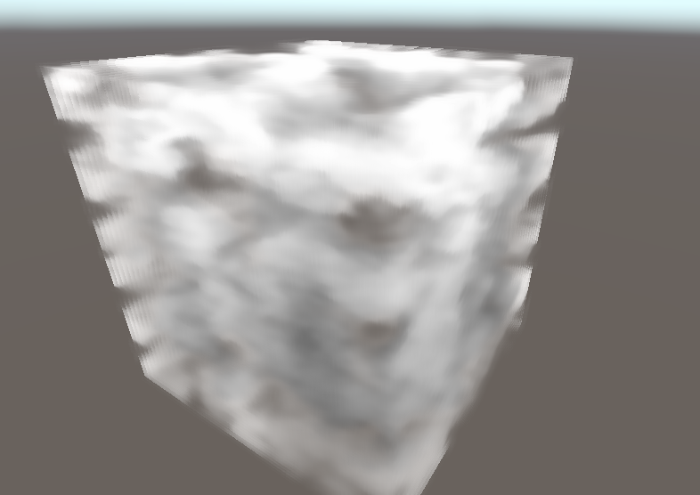
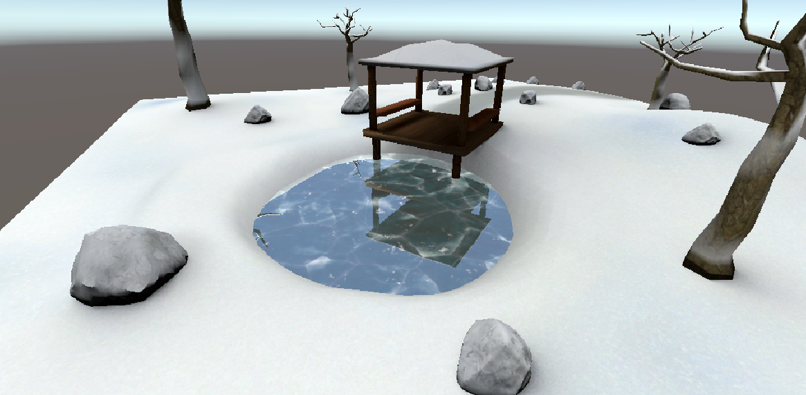
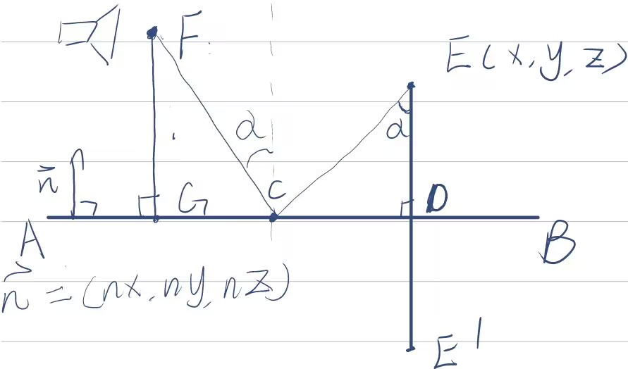
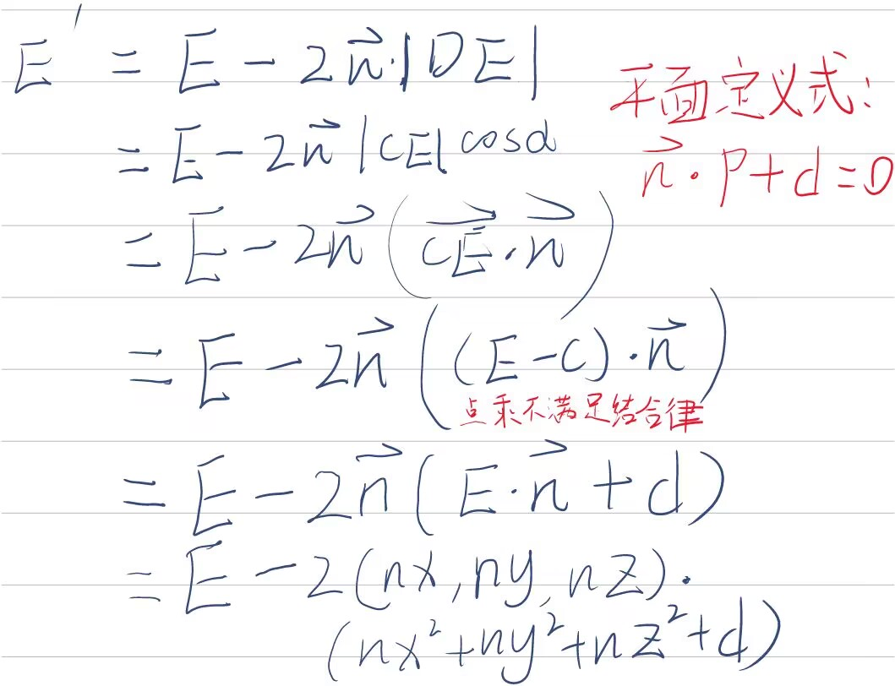
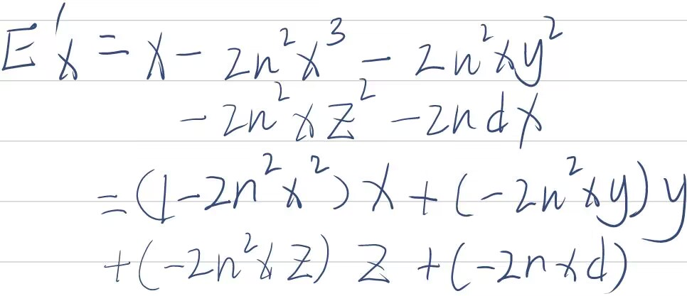

# Unity渲染效果 不断更新

这个项目将集成一些相关的渲染效果，最终成为一个完整的场景

这些效果注定存在许多不足，目的是为了体现功能性，有一个大致的框架。至于视觉效果、性能上的进一步优化，要等到以后再来补充。

目前已完成：

动态雪地

雪地覆盖

体积云（待优化）

平面反射

## 动态雪地




采用两张深度图分别记录物体位置与地面位置，计算出运动轨迹，根据轨迹进行凹陷。同时进行边缘检测，高斯模糊，实现雪地边缘的略微突起与内部平滑凹陷。

这个效果位于Assets/交互雪：

- CameraRenderOnce.cs: 手动使相机渲染一次，记录地面的初始深度
- ComputeDepthDiffer.cs: 调用ComputeShader计算深度差，并进行边缘检测、高斯模糊等处理（这个脚本的命名没有很准确）
- DifferDepth.compute: 实现上述效果的Compute Shader
- InteractiveSnowGround.shader: 雪地主材质shader
- SnowGroundManager.cs: 为shader进行参数赋值，如相机参数等

待改进的问题：边缘过渡还是不够平滑，例如人物两腿间距小，导致有锐利的突起，看上去更像碎冰。


## 雪地覆盖

这个效果相对而言比较容易，直接用顶点法线与向上的法向量相乘即可得到雪覆盖的效果，加上遮罩贴图来提升质感

在做这个效果中学到的主要是从blender中烘焙贴图，这里场景中使用的均为提前烘焙的静态贴图，因此不对光照做出反应





这个效果位于Assets/雪地覆盖

## 体积云（待优化）

> 云内部散射没有考虑，可能会导致内部过黑，且颜色不够有层次感，待优化

主要是在Renderer Feature，自定义后处理上踩了很多坑，同时由于为了适应新版URP，甚至于遇到了引擎本身的bug



主要思路是利用后处理实现（知乎上的文章都是采用后处理，但是是否有必要？后面可以尝试以正常半透明物体进行渲染），深度图重建世界坐标，采用光线步进，使用3D噪声图粗略模拟云的密度、光线传播衰减、折射率对光照的影响，简略模拟出体积云。

这个效果位于Assets/体积云：

- CloudPostProcess.shader，体积云后处理的主要shader文件，包含两个pass，第一个pass通过光线步进获取光照信息，第二个pass进行模糊处理，消除噪点。
- CloudDepth.shader，由于是采用后处理实现，为云写入深度
- VolumetricCloudRendererFeature.cs，挂载到renderer feature中，实现自定义后处理
- Cloud.cs，将云物体的参数传给material

## 平面反射

本来是想做SSR的，但是卡在了URP后处理为反射的物体做遮罩上，想用模板测试做遮罩，但是URP后处理对模板buffer清空，需要其他设置，奈何能力有限；或使用另一个相机按层级渲染并遮罩，但是性能开销太大，同时考虑到SSR的缺陷，不如直接做平面反射。



平面反射的基本思路：

- 使用另一个相机，Transform和FOV等影响直接投影的参数应当一致，同时要覆写相机的WorldToCamera矩阵，使场景内的物体在相机空间中垂直颠倒，这一步需要做一些数学推导：

  

  注：此处的n向量为法向单位向量。

  



于是可以依次写出空间反转的矩阵，将其加在WorldToCamera上，即为先对物体做空间反转，再进行空间变换

- 相机要手动渲染，为事件添加一个委托

  ```C#
  private void OnEnable()
  {
      RenderPipelineManager.beginCameraRendering += OnBeginCameraRendering;
  }
  ```

  即为当相机开始渲染的时候调用这个函数，主相机渲染时调用反射相机

  在这个委托中计算刚才的矩阵并覆写，同时使用invertCulling，来渲染被剔除的面，以渲染不可见的面，这也是较于SSR的优势。

  ```C#
  GL.invertCulling = true;
  //这个API存在Bug，应当直接使用"Obsolete"的RenderSingleCamera
  // RenderPipeline.SubmitRenderRequest(_reflectionCamera, context);
  UniversalRenderPipeline.RenderSingleCamera(context, _reflectionCamera);
  GL.invertCulling = false;
  ```

  至此反射纹理可以被正常渲染

- Shader的编写很简单，不过要注意的是，采样要使用反射平面的NDC坐标，以将纹理按屏幕空间投影，否则会将纹理平铺在平面上。

  

  

  

